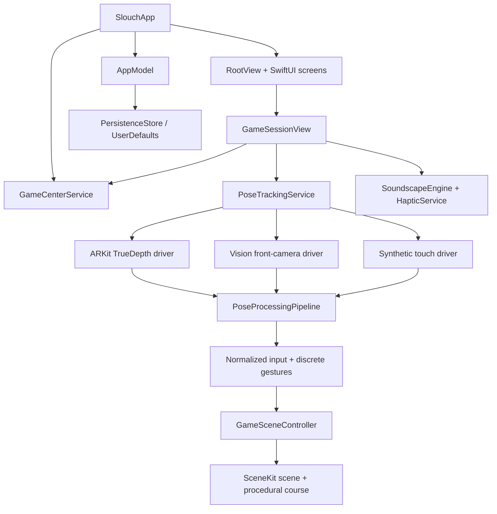

# Slouch Development Guide

## Requirements

- A Mac with a current Xcode installation and an iOS 17-or-later SDK
- iOS 17 or later deployment target
- An iPhone for real camera-control testing
- An Apple Development team for physical-device signing
- An App Store Connect app record for live Game Center leaderboards

The project has no external Swift packages. The checked-in `Slouch.xcodeproj` can be opened directly. `project.yml` is the XcodeGen definition and is only needed when changing targets, source layout, capabilities, or build settings.

## Open and run

```sh
git clone https://github.com/TheDudeCommits/Slouch.git
cd Slouch
open Slouch.xcodeproj
```

In Xcode:

1. Select the **Slouch** scheme.
2. Select an installed iPhone Simulator or connected iPhone.
3. Press **Run** (`Command-R`).

The project is portrait-only and targets iPhone. The current bundle identifier is `com.amirthedude69.slouch`.

### Command-line build and test

List the destinations installed with the selected Xcode:

```sh
DEVELOPER_DIR=/Applications/Xcode.app/Contents/Developer \
  xcodebuild -project Slouch.xcodeproj -scheme Slouch -showdestinations
```

Then replace `<SIMULATOR_NAME>` with one from that list:

```sh
DEVELOPER_DIR=/Applications/Xcode.app/Contents/Developer \
  xcodebuild \
  -project Slouch.xcodeproj \
  -scheme Slouch \
  -destination 'platform=iOS Simulator,name=<SIMULATOR_NAME>,OS=latest' \
  test
```

If command-line tools point to the standalone Command Line Tools package, either keep the `DEVELOPER_DIR` prefix above or select Xcode under **Xcode → Settings → Locations → Command Line Tools**.

### Regenerating the project

Only regenerate after changing `project.yml` or the target structure:

```sh
xcodegen generate
```

Commit both `project.yml` and the regenerated `.xcodeproj` so a fresh clone opens without requiring XcodeGen.

### Debug visual-QA entry points

Debug builds expose deterministic launch arguments for screenshots and renderer checks without changing the release flow:

- `-qa-home` opens the Observatory without replaying onboarding.
- `-qa-casual` opens a live synthetic-input Casual flight.
- `-qa-tech-neck` opens a live synthetic-input Tech Neck journey.

Set one argument in **Scheme → Run → Arguments**, or pass it after the bundle identifier with `simctl launch`. Release builds ignore these flags.

## Run on a physical iPhone

1. Connect and trust the iPhone. Enable Developer Mode if iOS requests it.
2. In the Slouch target's **Signing & Capabilities** tab, select an Apple Development team.
3. If Xcode reports that the bundle identifier is unavailable, replace `com.amirthedude69.slouch` with a unique identifier owned by that team. Keep the App Store Connect record and Game Center configuration consistent with it.
4. Select the iPhone as the run destination and press **Run**.
5. Grant camera access when the first camera-controlled flight requests it.
6. Place the phone upright on a stand, frame the face and upper shoulders, and complete calibration before moving.

TrueDepth ARKit face tracking is the preferred path when `ARFaceTrackingConfiguration` is supported. Other physical devices use the Vision front-camera fallback. Simulator runs never claim to test camera tracking; they automatically use deterministic touch input.

If the iPhone is running a newer iOS version than the installed Xcode supports, update Xcode before troubleshooting the app.

### Physical tracking test checklist

- Grant, deny, and later re-enable camera permission.
- Calibrate under normal, dim, and backlit conditions; low confidence should withhold control rather than amplify it.
- Confirm left/right steering signs and pitch direction after front-camera mirroring.
- Confirm one gesture event per nod, retraction, or side bend, followed by neutral rearming.
- Move the face out of frame and confirm tracking becomes limited or lost without a sudden ship jump.
- Make a deliberately quick but still safe test motion and confirm the short abrupt-motion pause.
- Pause, reposition the phone, recalibrate, and resume.
- Tune sensitivity at its low and high UI limits.
- Complete both 90-second Casual and three-minute Tech Neck routes.

Never ask a tester to exceed a comfortable range simply to cross a threshold. Tracking thresholds are game-input tuning, not clinical measurements.

## Game Center setup

The entitlement is already checked in at `Slouch/Resources/Slouch.entitlements`, and `GameCenterService` uses these exact identifiers:

| Mode | Leaderboard identifier |
| --- | --- |
| Casual Flight | `slouch.casual.highscore` |
| Tech Neck Journey | `slouch.techneck.highscore` |

Before global scores can appear:

1. Register or use the App ID that matches the Xcode bundle identifier and enable Game Center for it.
2. Create the app in App Store Connect with that bundle ID.
3. In the app's Game Center configuration, create two classic leaderboards using the identifiers above exactly, including capitalization.
4. Give each board a localized display name, configure higher integer scores as better, and use an integer score format appropriate for arcade points.
5. Add the leaderboards to the app version or Game Center configuration as required by App Store Connect, then save the configuration.
6. Run a development build on a signed device and authenticate with a Game Center sandbox or eligible test account.

`GameCenterService` submits only the final integer score. Casual and Tech Neck use separate dashboard views. If authentication, networking, or App Store Connect setup is unavailable, submission fails quietly and the local score remains authoritative.

Leaderboard eligibility currently requires a completed, real-camera run plus sufficient tracking quality and smoothness. Synthetic/touch runs remain local by design.

## Architecture



### Responsibilities

| Area | Main types | Responsibility |
| --- | --- | --- |
| App shell | `SlouchApp`, `RootView`, `AppRouter` | Dependency injection, onboarding, tab navigation |
| Product state | `AppModel`, `GameModels` | Runs, scoring history, points, streaks, store, settings |
| Product UI | `Views/PlaceholderViews.swift` | Home, preflight, scores, store, settings, onboarding, lore and privacy screens |
| Live game | `GameView`, `GameSceneView`, `GameSceneController` | Session lifecycle, HUD, controls, procedural SceneKit flight |
| Pose input | `PoseTrackingService`, capture drivers, `PoseProcessingPipeline` | Permission, source selection, calibration, smoothing, safety gating, gesture events |
| Feedback | `SoundscapeEngine`, `HapticService` | Runtime-generated ambient audio, effects, and haptics |
| Platform | `GameCenterService` | Authentication state, score submission, leaderboard IDs |
| Persistence | `PersistenceStore` | Codable profile, settings, and onboarding state in `UserDefaults` |

The renderer and tracker are intentionally separated. SceneKit consumes normalized `GameControlInput` and gesture actions, so gameplay remains testable with synthetic input and the tracking implementation can evolve without rewriting the course.

The tracking service does not provide an API for retaining frames. Capture drivers extract pose measurements, the processing pipeline calibrates and smooths them, and the UI receives only normalized samples, status, and discrete gesture events.

## Data and persistence

`AppModel` stores three Codable values in `UserDefaults`:

- `slouch.profile.v1`: points, streak, freezes, themes, 50 recent attempts plus preserved per-mode top-ten records
- `slouch.settings.v1`: sound, haptics, sensitivity, comfort and preferred-mode settings
- `slouch.onboarding.v1`: onboarding completion

The local leaderboard sorts run history by score and shows the top ten. Resetting progress clears these app-owned values by replacing them with defaults; it does not remove Apple-managed Game Center scores.

The privacy manifest declares no tracking, no tracking domains, and no collected-data categories. It also declares the required reasons used for app-owned `UserDefaults` preferences (`CA92.1`) and elapsed-time measurement from system boot time (`35F9.1`). Any product change that records analytics, transmits movement metrics, adds an SDK, or changes persistence must trigger a privacy-manifest and disclosure review.

## Testing

### Automated coverage

`SlouchTests/AppModelTests.swift` currently verifies:

- A first completed course starts a streak, awards points, and records a best score.
- One streak freeze protects a single missed day and is consumed.
- An incomplete attempt cannot replace a completed personal best.
- History trimming preserves an older genuine high score.
- An expired streak reconciles when the app becomes active again.

When extending the project, add deterministic tests around pose calibration, gesture neutral-rearming, abrupt-motion gating, score eligibility, purchases, and longer streak gaps.

### Manual release matrix

| Area | Minimum check |
| --- | --- |
| First launch | All onboarding pages and safety acknowledgement; camera prompt on first flight |
| Casual | Full 90-second camera and touch runs; head-follow steering, collision, pickup, summary |
| Tech Neck | Full three-minute route; every cue family; neutral return; early exit |
| Lifecycle | Pause/resume, background/foreground, interruption, recalibration |
| Progression | Points, local top ten, streak next day, freeze behavior, theme purchase/select |
| Settings | Music, effects, haptics, sensitivity, preferred mode, reset flow |
| Game Center | Signed in, signed out, offline, both board IDs, local fallback |
| Accessibility | VoiceOver labels for controls, touch demo, Reduce Motion preference review |
| Devices | At least one TrueDepth iPhone, one Vision-fallback path where available, and Simulator |
| Privacy | No recorded media, no network upload of frames, correct permission copy and manifest |

For camera changes, unit tests and Simulator input are necessary but not sufficient. Finish with a real-device session because camera mirroring, lighting, interruptions, thermal behavior, and sensor availability cannot be validated in Simulator.

## Release checklist

- Choose the production bundle ID, signing team, version, and build number.
- Configure and test both Game Center leaderboard records.
- Review camera permission wording, in-app privacy copy, privacy manifest, and App Store privacy answers together.
- Verify the app remains portrait-only and stationary-use instructions are visible before flight.
- Run unit tests, archive with distribution signing, and validate the archive in Xcode.
- Test the archived build through TestFlight on representative physical devices.
- Recheck [ATTRIBUTIONS.md](../ATTRIBUTIONS.md) whenever visual, audio, font, or code dependencies are added.
