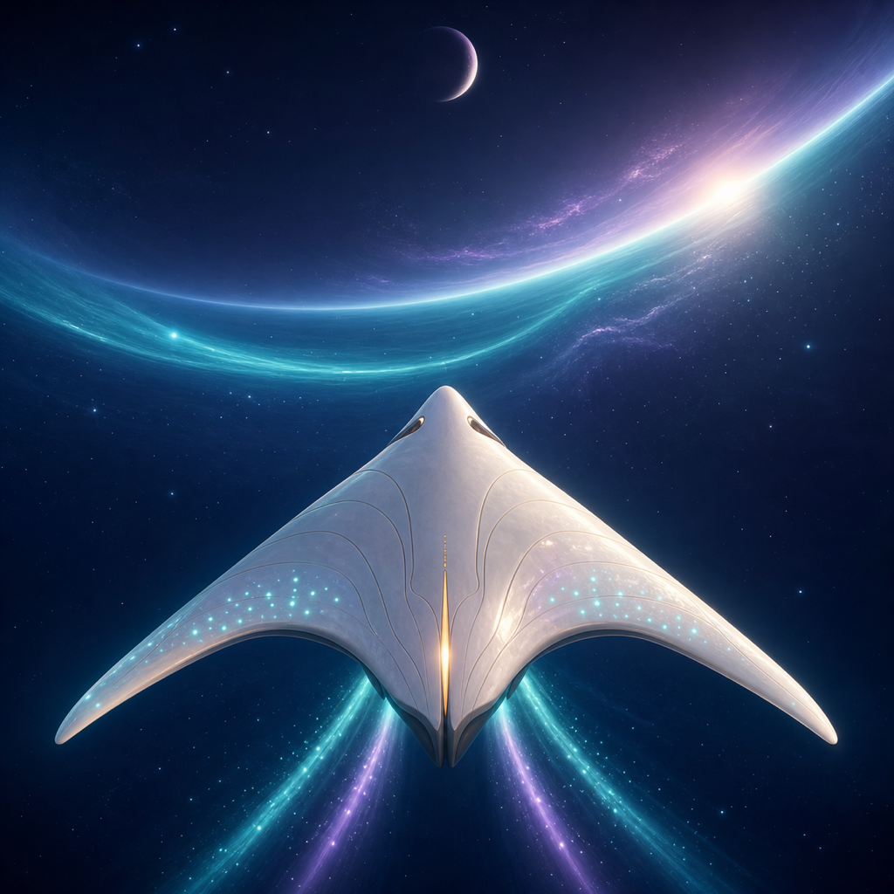
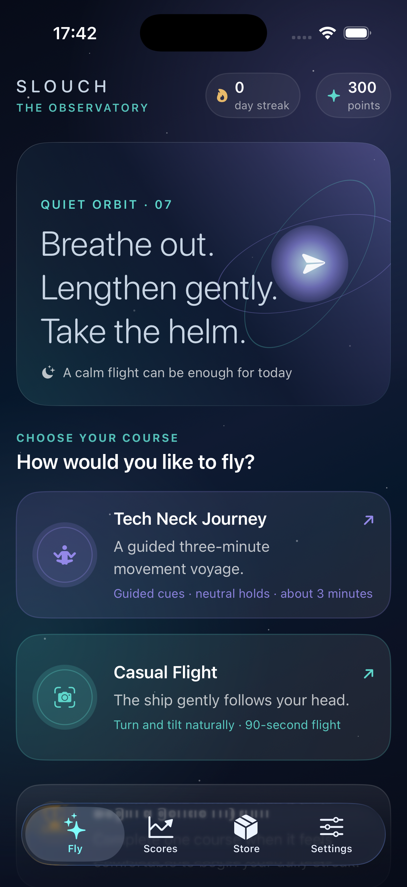
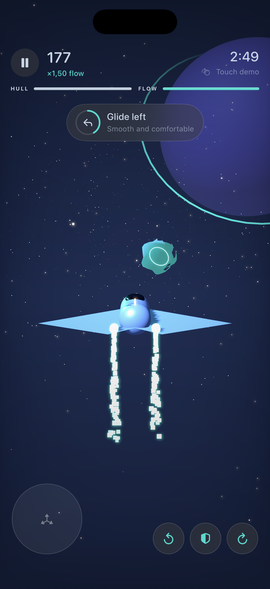

# Slouch

<p align="center">
  
</p>

**A calming, camera-controlled space dodger for iPhone.** Slouch places a moonstone spacecraft in a luminous asteroid river and turns small, comfortable head movements into on-rails flight controls.

The game is built natively with SwiftUI, SceneKit, ARKit, Vision, AVFoundation, and GameKit. It targets **iOS 17 or later**, runs in portrait, and is designed for stationary play with the phone upright on a stable surface or stand.





> Slouch is a game and general movement experience, not a medical device or treatment. Use only a comfortable range of motion and stop if a movement causes pain, dizziness, numbness, headache, or unusual discomfort.

## What is included

- Third-person rear-chase flight through a procedural asteroid field, gates, drones, laser obstacles, and pickups.
- **Casual Flight:** a 90-second run in which the ship follows head direction.
- **Tech Neck Journey:** a guided three-minute course using neutral holds, turns, small nods, gentle retractions, and side bends.
- TrueDepth face tracking where supported, with an on-device Vision front-camera fallback.
- Simulator and accessibility-friendly touch controls; touch-demo scores stay local.
- Local high scores, separate Game Center leaderboards, daily streaks, streak freezes, points, and unlockable visual themes.
- Music, sound effects, haptics, sensitivity, comfort, camera, lore, privacy, and progress settings.
- Original procedural 3D visuals and a synthesized ambient soundscape with no downloaded runtime asset packs.

## Play it in Xcode

1. Clone the repository and open the checked-in project:

   ```sh
   git clone https://github.com/AmirTheDude69/Slouch.git
   cd Slouch
   open Slouch.xcodeproj
   ```

2. Select the **Slouch** scheme and an iPhone Simulator.
3. Press **Run** (`Command-R`).
4. Complete onboarding, select a mode, confirm the stationary-play check, and begin the flight.

The Simulator automatically uses the touch deck because it has no usable front-camera pose stream. Drag the circular pad to steer in Casual. Tech Neck also shows three cue buttons for roll left, boost, and roll right. These runs exercise the full game loop but are not eligible for Game Center submission.

To use head controls, run on an iPhone with iOS 17 or later. In **Signing & Capabilities**, select your Apple Development team, then choose the connected device and run. The current bundle identifier is `com.amirthedude69.slouch`; change it if that identifier is not available to your team.

Detailed setup, physical-device checks, Game Center configuration, architecture, and test commands are in [Development Guide](Docs/DEVELOPMENT.md). Player controls, calibration, privacy, and safety guidance are in [Play Guide](Docs/PLAY_GUIDE.md).

## Controls at a glance

| Comfortable movement | In-game response |
| --- | --- |
| Turn left or right | Steer across the flight corridor |
| Small chin nod | Follow vertically in Casual; answer nod cues in Tech Neck |
| Gentle head retraction | Activate a shielded boost |
| Gentle side bend | Roll-dodge in that direction |
| Relaxed shoulder-set cue | Collect optional recovery pickups in the guided route |
| Return to neutral | Rearm one-shot gesture controls and support the flow multiplier |

Calibration treats the player's comfortable starting position as neutral; the values in code are interaction thresholds, not posture targets. See [Play Guide](Docs/PLAY_GUIDE.md) before testing camera control.

## Progression

Completed flights award points, update the local top ten, and can extend the daily streak. A streak freeze automatically protects one single missed day when available. Recent history stays bounded while each mode's genuine top ten is preserved. Points unlock **Aurora Drift**, **Solar Ember**, and additional freezes; **Jungle Run** is represented as a future-theme slot.

Camera-controlled, completed runs that meet tracking and smoothness safeguards can be submitted to separate Game Center boards. Local history remains available when Game Center is signed out or not yet configured.

## Repository map

```text
Slouch/
├── App/          App lifecycle, navigation, shared model
├── Design/       Visual tokens and reusable styling
├── Game/         SceneKit flight renderer and live game UI
├── Models/       Modes, runs, settings, themes, store items
├── Resources/    App icon, privacy manifest, entitlements
├── Services/     Persistence, Game Center, sound, haptics
├── Tracking/     TrueDepth/Vision capture, calibration, gestures
└── Views/        Onboarding and product screens
SlouchTests/      Progression and streak unit tests
Docs/             Play, safety, setup, architecture, release notes
project.yml       XcodeGen project definition
```

## Privacy

Camera frames are processed in memory on the device to derive normalized control values. Slouch does not record, save, or upload camera frames. Local settings, progression, and run summaries are stored on the device. If the player is signed into Game Center, an eligible final score can be sent to Apple for the selected leaderboard.

The app includes a privacy manifest declaring no app tracking or collected-data categories, plus Apple's required-reason declarations for local preferences and elapsed-time measurement. Review [Play Guide](Docs/PLAY_GUIDE.md#privacy) and the manifest at `Slouch/Resources/PrivacyInfo.xcprivacy` before distribution.

## Project notes

- The checked-in `.xcodeproj` opens directly; XcodeGen is needed only when changing `project.yml` or target structure.
- The Game Center entitlement is present, but the two leaderboard records must be created in App Store Connect before global scores appear.
- No external Swift packages or third-party runtime libraries are required.
- Asset origin and the image-generation disclosure are recorded in [ATTRIBUTIONS.md](ATTRIBUTIONS.md).
